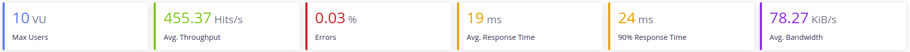
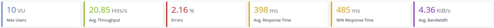

# Monitorización de líneas de producción
Proyecto para la asignatura de Cloud Computing en el Máster en Ingeniería Informática UGR.
 
 
[](https://www.gnu.org/licenses/gpl-3.0)
[](https://travis-ci.org/ibe16/CC-19-20-Proyecto)
[](https://codecov.io/gh/ibe16/CC-19-20-Proyecto)
[](https://github.com/ellerbrock/open-source-badges/)
 
 
---
 
## Descripción del proyecto
Con este proyecto se quiere monitorizar los downtimes de las líneas de una fábrica. Consta de 2 entidades:
- **PlantMonitoring:** Se encarga de leer los datos de las líneas y almacenarlos en una base de datos. Los datos que se almacenan son el instante en el que se produce un downtime y la duración de este.
- **Notifier:** Su función es notificar a una lista de contactos que se ha producido un downtime y volver a avisar cuando se restablezca la línea.
 
## Arquitectura
Como arquitectura se ha elegido una arquitectura basada en microservicios, donde cada microservicio corresponde con las entidades descritas.
 
Más información sobre la [arquitectura y el funcionamiento][arquitectura] del todo el sistema.
 
 
## Lenguajes y tecnologías usadas
El proyecto se desarrolla usando Python más:
- Flask para la interfaz REST
- Celery para gestionar los eventos
- MySQL y MongoDB como bases de datos
- Consul para la configuración distribuida
 
Más información sobre [lenguajes y tecnologías usadas][tecnologías].
 
## Prerrequisitos
Las versiones de Python compatibles con el proyecto son:
   Linux:
       -Mínima: 3.6
       -Máxima: 3.8 y su versión de desarrollo
 
Para poder usar la herramienta de construcción es necesario:
1. Instalarla con:
 
   ```
   pip install invoke
   ```
 
2. Instalar las dependencias
   ```
   pip install -r requirements.txt
   ```
 
En cualquiera de los dos casos quedará disponible
 
## Herramienta de construcción
buildtool: tasks.py
 
La herramienta de construcción usada es ```Invoke```.
 
Para poder usar la herramienta de construcción es necesario:
1. Instalarla con:
 
   ```shell
   $ pip install invoke
   ```
 
2. Instalar las dependencias
   ```shell
   $ pip install -r requirements.txt
   ```
 
En cualquiera de los dos casos quedará disponible.
 
Se han configurado cuatro tareas. Estas son:
1. Instalar las dependencias necesarias
   ```shell
   $ invoke install
   ```
   > Instala todas la dependencias necesarias para el proyecto. Si previamente se ha ejecutado ```pip install -r requirements.txt``` no es necesario ejecutar esta tarea.
 
   > Se pueden consultar las dependencias usadas en el archivo [requirements.txt][enlace_dependencias]
 
2. Ejecutar los test unitarios
   ```shell
   $ invoke test
   ```
   > Ejecuta todos los test unitarios. Para ello se ha usado el framework ```Pytest```.
 
3. Ejecutar los test de cobertura
   ```shell
   $ invoke coverage
   ```
   > Ejecuta los test de cobertura y almacena los resultados en un archivo ```.coverage```. Para la ejecución de estos test se ha usado un el módulo ```pytest-cov``` que proporciona ```Pytest```.
4. Limpiar los archivos generados por los test
   ```shell
   $ invoke clean
   ```
   >Incluido el archivo ```.coverage```.
 
5. Levantar los microservicios
   ```shell
   $ invoke start <ip> <puerto>
   ```
   > Levanta los microservicios usando [Gunicorn][offi_docu_gunicorn], un servidor WSGI HTTP para `Python`. Si no se indica la ip y el puerto donde se quiere enlazar el servicio por defecto se establecerá `0.0.0.0:5000`y el `0.0.0.0:5051`
   > Para comprobar que se ha levantado adecuadamente se puede consultar `http:\\<ip>:<puerto>\hello`. Esto devolverá un `Hello, World!`
 
6. Parar los microservicios
   ```shell
   $ invoke stop
   ```
   > Mata el proceso donde se ejecutaba el microservicio.
 
En el momento de la ejecución se pueden listar las tareas disponibles usando ```invoke --list```.
 
Para más información sobre los comandos que se ejecutan y su opciones de configuración consulte el fichero [tasks.py][enlace_tasks].
 
## Integración continua
Como herramienta de integración continua se ha usado `TravisCI` y `Github Actions`. Para más información sobre que se realiza con ambas herramientas puede ir a la [documentación correspodiente][docu_integracion]. También puede consultar los archivos de configuración de [TravisCI][enlace_Travis] y el [workflow de Github Actions][enlace_workflow].
 
## Docker
Se han creado varios contenedores para los microservicios notifier y monitor.

Contenedor: https://hub.docker.com/r/ibe16/notifier

Contenedor: https://hub.docker.com/r/ibe16/monitor
 
Para consultar como se ha realizado se puede visitar el siguiente [enlace][docu_docker].
 
 
## Heroku
La imagen del microservicio está desplegada en Heroku. Para comprobarlo se puede usar la url: https://cc-notifier.herokuapp.com/hello.
 
Para más información acerca de cómo se ha realizado el despliegue se puede consultar el siguiente [enlace.][docu_heroku]

## Bases de datos
Se usarán **PostgreSQL** para gestionar y consultar mejor los datos de tipo *DATE* y  **MongoDB** para almacenar a donde hay qué mandar las notificaciones, para que sea más cómodo gestionar las listas.

Para la implementación de ambas bases de datos se ha usado un ORM para mapear los objetos de la base de datos a objetos de Pyhton y marcar los esquemas que deben seguir estos. Para los dos microservicos se ha usado en mismo patrón: una clase para definir cómo son los objetos y que realiza la conexión a la base de datos y otra clase que define las operaciones con la base de datos. 

Para el **Microservicio Notifier** estas clases son:
- [NotificationList_model.py][enlace_NotificationList_model]
- [NotificationList.py][enlace_NotificationList]

Para el **Microservicio Monitor** estas clases son:
- [DowntimeRecord_model.py][enlace_DowntimeRecord_model]
- [DowntimeRecord.py][enlace_DowntimeRecord]

Para saber más acerca de la implementación de las bases de datos consulte el siguiente [fichero][docu_basesdatos].

## Evaluación de prestaciones

Prestaciones: stress_test.yml

Para la evaluación de las prestaciones de ambos microservicos se ha utlizado `Taurus`. El objetivo que se quiere conseguir es alcanzar las 1000 peteciones/s con 10 usuarios concurrentes. 

Para saber más acerca de las prestaciones consulte el siguiente [enlace][docu_prestaciones].

## Creación de una máquina virtual
Para la creación de la máquina virtual vamos a usar Vagrant más Virtualbox. Lo primero que tenemos que hacer es descargar e instalar estás dos herramientas. Después para crear el `Vagrantfile` ejecutamos el comando `vagrant init` en la raíz del proyecto.

Se puede consultar el fichero [Vagrantfile][enlace_vagrantfile] que contiene comentarios explicativos acerca de la creación de la máquina virtual.

La máquina virtual se usará para desplegar los contenedores de docker que ya se tenían anteriormente.

## Provisionamiento con Ansible
Una vez que tengamos la máquina virtual configurada, el siguiente paso es hacer el provisionamiento. Para ello usaremos **Ansible**.

Para poder utilizar Ansible deberemos descargarlo primero. En mi caso al utilizar un gestor de versiones para Python se ha instalado con `pip`.

Lo siguiente que hay que hacer es crear los ficheros de configuración de Ansible:
1. Un fichero de configuración general [ansible.cfg][enlace_ansiblecfg].
2. Un fichero, **inventario**, con el nombre de los hosts que se van a utilizar [ansible_hosts][enlace_ansiblehosts].
3. Los playbooks que vayamos a usar.

> Si usamos Vagrant para automatizar el provisionamiento debemos indicar donde se encuentra el fichero que queremos utilizar como inventario. Si no, Vagrant creará uno por defecto.

Después de esto en nuestro `Vagrantfile` tenemos que indicar:
1. Qué hosts de ansible vamos a usar.
2. Dónde se encuentran los playbooks que vamos a utilizar.
3. Dónde se encuentra el inventario si no usamos el por defecto.

> Para más información se puede consultar el [Vagrantfile][enlace_vagrantfile] y los [ficheros de configuración] de Ansible.

## Despliegue en Azure
Para el despliegue de la MV en Azure se han seguido los siguientes pasos:
1. Crear una cuenta de estudiante en Azure
2. Instalar Azure-CLI. Para ello se ha seguido la siguiente [documentación][offi_docu_install_azure].
3. Registramos la aplicación en Azure. Esto nos proporcionará una serie de claves para poder crear la MV desde Vagrant.
    ```shell
    $ az ad sp create-for-rbac
    ```
4. Conseguir el ID de nuestra subscripción de azure
    ```shell
    $ az account list --query "[?isDefault].id" -o tsv
    ```
5. Creamos las siguientes variables de entorno para guardar las claves que nos ha proporcionado los pasos anteriores:
    - AZURE_TENANT_ID = `tenant`
    - AZURE_CLIENT_ID = `appId`
    - AZURE_CLIENT_SECRET = `password`
    - AZURE_SUBSCRIPTION_ID = `SubscriptionId`
6. Modificamos el [Vagrantfile][enlace_vagrantfile] para que use como proveedor Azure. Se puede consultar el fichero para más información. También tendremos que añadir la inofrmación necensario al [inventario][enlace_ansiblehosts].
7. Instalamos el plugin de Vagrant `vagrant-azure`.
    ```shell
    $ vagrant plugin install vagrant-azure
    ```
8. Instalamos una `box` que Vagrant pueda usar. Realmente esta `box` no hace nada.
    ```shell
    $ vagrant box add azure https://github.com/azure/vagrant-azure/raw/v2.0/dummy.box --provider azure
    ```
> Para los pasos del 3 al 9 se ha seguido la siguiente [documentación][use_vagrant_azure].

Por último debemos ejecutar `vagrant up --privider=azure` para la creación de la máquina.

## Comandos para provisionar la máquina

Cuando creamos la máquina virtual con vagrant se ejecuta el playbook [provisioning.yml][enlace_provisioning] automáticamente. Este lo que hace es actualizar, instalar las dependencias necesarios para poder usar Docker y Docker-Compose, descargar las imágenes necesarias y contruir los contenedores. Una vez que la máquina está cosntruida también podemos ejecutar este playbook haciendo:
```
$ vagrant provision

```

Para levantar los servicios se ha realizado el playbook [start_services.yml][enlace_startservices]. Para ejecutarlo:
```
$ ansible-playbook -i ./provision/ansible_hosts ./provision/start_services.yml

```

Para pararlos existe el playbook [stop_services.yml][enlace_stopservices]. Para ejecutarlo: 
```
$ ansible-playbook -i ./provision/ansible_hosts ./provision/stop_services.yml

```

## Elección del SO para la máquina virtual.

Bien, una vez tenemos la confuguración necesaria para crear y aprovisionar las MV vamos a elegir un SO para ellas. Para ello tenemos que tener en cuenta que el [rol de Ansible][rol_ansible] que estamos utilizando tiene compatibilidad solo con las siguientes plataformas:

- Ubuntu 16.04 LTS (Xenial)
- Ubuntu 18.04 LTS (Bionic)
- Debian 9 (Stretch)
- Debian 10 (Buster)

Las box que están disponibles para Vagrant para hacer las pruebas locales son:
- ubuntu/xenial64 (Ubuntu 16.04 LTS)
- ubuntu/bionic64 (Ubuntu 18.04 LTS)
- debian/stretch64 (Debian 9)
- debian/buster64 (Debian 10)

Los resultados obtenidos son los siguientes:

### Ubuntu 16.04 LTS


### Ubuntu 18.04 LTS


### Debian 9


### Debian 10


Como se puede ver el sistema operativo que ofrece mejores prestaciones es **Debian 10**, así que este será el que usemos para construir las máquinas virtuales.

## Test de prestaciones en local
Para la máquina vistual que se ha desplegado en local se ha elegido la siguiente configuración:
- 2 CPUs
- 2 GB de RAM

Como los recursos de los que dispone son limitados, no podemos esperar un nivel de prestaciones similar al que obteníamos corriendo los microservicios en local.

Los resultados que se obtienen para cada microservicio son:

### Microservicio Notifier


### Microservicio Monitor


### Ambos microservicios


## Test de prestaciones para la MV en Azure

Se intentó hacer test de prestaciones para la máquina virtual que está desplegada en Azure. Sin embargo, está dispone de una configuración por defecto que previene los ataques DDoS, por lo que las prestaciones que se obtienen al realizar los test no son muy fiables. Aquí se encuentra el enlace donde se explica esta configuración de seguridad: https://docs.microsoft.com/es-es/azure/virtual-network/ddos-protection-overview

La máquina dispones de la siguiente configuración:
- 2 CPUs
- 8 GB RAM

Son unos recursos hardware similares a los que se tienen en la cuando se pasan los test en local (mi ordenader dispone de 4CPUs y 8GB de RAM), sin embargo las prestaciones que se obtienen son las siguientes:



Al no poderse desactivar la opción de seguridad y no haber un método que nos permita añadir IPs seguras o similar, no podemos asegurar cual es el nivel de prestaciones de los servicios.


[arquitectura]:https://ibe16.github.io/CC-19-20-Proyecto/docs/arquitectura/Arquitectura

[docu_basesdatos]: https://ibe16.github.io/CC-19-20-Proyecto/docs/inyeccion_dependencias/bases_de_datos
 
[docu_bench]:https://ibe16.github.io/CC-19-20-Proyecto/docs/bench/ab

[docu_docker]:https://ibe16.github.io/CC-19-20-Proyecto/docs/dockerhub/docker

[docu_heroku]:https://ibe16.github.io/CC-19-20-Proyecto/docs/heroku/heroku
 
[docu_integracion]:https://ibe16.github.io/CC-19-20-Proyecto/docs/ic/integracion_continua

[docu_prestaciones]: https://ibe16.github.io/CC-19-20-Proyecto/docs/prestaciones/resultados

[enlace_ansiblecfg]: https://github.com/ibe16/CC-19-20-Proyecto/blob/master/provision/ansible.cfg

[enlace_ansiblehosts]: https://github.com/ibe16/CC-19-20-Proyecto/blob/master/provision/ansible_hosts

[enlace_db_monitor]: https://github.com/ibe16/CC-19-20-Proyecto/blob/master/monitor/db.py

[enlace_db_notifier]:https://github.com/ibe16/CC-19-20-Proyecto/blob/master/notifier/db.py
 
[enlace_dependencias]:https://github.com/ibe16/CC-19-20-Proyecto/blob/master/requirements.txt

[enlace_DowntimeRecord]:https://github.com/ibe16/CC-19-20-Proyecto/blob/master/monitor/DowntimeRecord.py

[enlace_DowntimeRecord_model]:https://github.com/ibe16/CC-19-20-Proyecto/blob/master/monitor/DowntimeRecord_model.py 

[enlace_monitor]: https://github.com/ibe16/CC-19-20-Proyecto/blob/master/monitor/Monitor.py

[enlace_Notifier]: https://github.com/ibe16/CC-19-20-Proyecto/blob/master/notifier/Notifier.py
 
[enlace_NotificationList]:https://github.com/ibe16/CC-19-20-Proyecto/blob/master/notifier/NotificationList.py
 
[enlace_NotificationList_model]:https://github.com/ibe16/CC-19-20-Proyecto/blob/master/notifier/NotificationList_model.py

[enlace_provisioning]: https://github.com/ibe16/CC-19-20-Proyecto/blob/master/provision/provisioning.yml

[enlace_startservices]: https://github.com/ibe16/CC-19-20-Proyecto/blob/master/provision/start_services.yml

[enlace_stopservices]: https://github.com/ibe16/CC-19-20-Proyecto/blob/master/provision/stop_services.yml

[enlace_tasks]:https://github.com/ibe16/CC-19-20-Proyecto/blob/master/tasks.py
 
[enlace_travis]:https://github.com/ibe16/CC-19-20-Proyecto/blob/master/.travis.yml
 
[enlace_vagrantfile]: https://github.com/ibe16/CC-19-20-Proyecto/blob/master/Vagrantfile

[enlace_workflow]:https://github.com/ibe16/CC-19-20-Proyecto/blob/master/.github/workflows/pythonpackage.yml
 
[offi_docu_gunicorn]: https://gunicorn.org/
 
[offi_docu_docker]:https://docs.docker.com/install/linux/docker-ce/ubuntu/
 
[offi_docu_docker_gh]:https://docs.docker.com/docker-hub/builds/

[offi_docu_install_azure]: https://docs.microsoft.com/en-us/cli/azure/install-azure-cli-apt?view=azure-cli-latest

[offi_docu_pymodm]:https://pymodm.readthedocs.io/en/stable/

[offi_docu_sqlalchemy]:https://docs.sqlalchemy.org/en/13/
 
[rol_ansible]: https://github.com/nickjj/ansible-docker

[tecnologías]:https://ibe16.github.io/CC-19-20-Proyecto/docs/tecnologías/Tecnologías

[use_vagrant_azure]: https://github.com/Azure/vagrant-azure
 
[layer_scheme]:docs/arquitectura/esquema_capas.jpg
