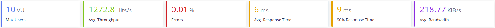
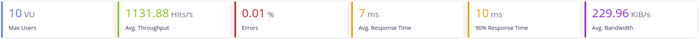

# Monitorización de líneas de producción
Proyecto para la asignatura de Cloud Computing en el Máster en Ingeniería Informática UGR.
 
 
[](https://www.gnu.org/licenses/gpl-3.0)
[](https://travis-ci.org/ibe16/CC-19-20-Proyecto)
[](https://codecov.io/gh/ibe16/CC-19-20-Proyecto)
[](https://github.com/ellerbrock/open-source-badges/)
 
 
---
 
## Descripción del proyecto
Con este proyecto se quiere monitorizar los downtimes de las líneas de una fábrica. Consta de 2 entidades:
- **PlantMonitoring:** Se encarga de leer los datos de las líneas y almacenarlos en una base de datos. Los datos que se almacenan son el instante en el que se produce un downtime y la duración de este.
- **Notifier:** Su función es notificar a una lista de contactos que se ha producido un downtime y volver a avisar cuando se restablezca la línea.
 
## Arquitectura
Como arquitectura se ha elegido una arquitectura basada en microservicios, donde cada microservicio corresponde con las entidades descritas.
 
Más información sobre la [arquitectura y el funcionamiento][arquitectura] del todo el sistema.
 
 
## Lenguajes y tecnologías usadas
El proyecto se desarrolla usando Python más:
- Flask para la interfaz REST
- Celery para gestionar los eventos
- MySQL y MongoDB como bases de datos
- Consul para la configuración distribuida
 
Más información sobre [lenguajes y tecnologías usadas][tecnologías].
 
## Prerrequisitos
Las versiones de Python compatibles con el proyecto son:
   Linux:
       -Mínima: 3.6
       -Máxima: 3.8 y su versión de desarrollo
 
Para poder usar la herramienta de construcción es necesario:
1. Instalarla con:
 
   ```
   pip install invoke
   ```
 
2. Instalar las dependencias
   ```
   pip install -r requirements.txt
   ```
 
En cualquiera de los dos casos quedará disponible
 
## Herramienta de construcción
buildtool: tasks.py
 
La herramienta de construcción usada es ```Invoke```.
 
Para poder usar la herramienta de construcción es necesario:
1. Instalarla con:
 
   ```shell
   $ pip install invoke
   ```
 
2. Instalar las dependencias
   ```shell
   $ pip install -r requirements.txt
   ```
 
En cualquiera de los dos casos quedará disponible.
 
Se han configurado cuatro tareas. Estas son:
1. Instalar las dependencias necesarias
   ```shell
   $ invoke install
   ```
   > Instala todas la dependencias necesarias para el proyecto. Si previamente se ha ejecutado ```pip install -r requirements.txt``` no es necesario ejecutar esta tarea.
 
   > Se pueden consultar las dependencias usadas en el archivo [requirements.txt][enlace_dependencias]
 
2. Ejecutar los test unitarios
   ```shell
   $ invoke test
   ```
   > Ejecuta todos los test unitarios. Para ello se ha usado el framework ```Pytest```.
 
3. Ejecutar los test de cobertura
   ```shell
   $ invoke coverage
   ```
   > Ejecuta los test de cobertura y almacena los resultados en un archivo ```.coverage```. Para la ejecución de estos test se ha usado un el módulo ```pytest-cov``` que proporciona ```Pytest```.
4. Limpiar los archivos generados por los test
   ```shell
   $ invoke clean
   ```
   >Incluido el archivo ```.coverage```.
 
5. Levantar los microservicios
   ```shell
   $ invoke start <ip> <puerto>
   ```
   > Levanta los microservicios usando [Gunicorn][offi_docu_gunicorn], un servidor WSGI HTTP para `Python`. Si no se indica la ip y el puerto donde se quiere enlazar el servicio por defecto se establecerá `0.0.0.0:5000`y el `0.0.0.0:5051`
   > Para comprobar que se ha levantado adecuadamente se puede consultar `http:\\<ip>:<puerto>\hello`. Esto devolverá un `Hello, World!`
 
6. Parar los microservicios
   ```shell
   $ invoke stop
   ```
   > Mata el proceso donde se ejecutaba el microservicio.
 
En el momento de la ejecución se pueden listar las tareas disponibles usando ```invoke --list```.
 
Para más información sobre los comandos que se ejecutan y su opciones de configuración consulte el fichero [tasks.py][enlace_tasks].
 
## Integración continua
Como herramienta de integración continua se ha usado `TravisCI` y `Github Actions`. Para más información sobre que se realiza con ambas herramientas puede ir a la [documentación correspodiente][docu_integracion]. También puede consultar los archivos de configuración de [TravisCI][enlace_Travis] y el [workflow de Github Actions][enlace_workflow].
 
## Docker
Se han creado varios contenedores para los microservicios notifier y monitor.

Contenedor: https://hub.docker.com/r/ibe16/notifier

Contenedor: https://hub.docker.com/r/ibe16/monitor
 
Para consultar como se ha realizado se puede visitar el siguiente [enlace][docu_docker].
 
 
## Heroku
La imagen del microservicio está desplegada en Heroku. Para comprobarlo se puede usar la url: https://cc-notifier.herokuapp.com/hello.
 
Para más información acerca de cómo se ha realizado el despliegue se puede consultar el siguiente [enlace.][docu_heroku]

## Bases de datos
Se usarán **PostgreSQL** para gestionar y consultar mejor los datos de tipo *DATE* y  **MongoDB** para almacenar a donde hay qué mandar las notificaciones, para que sea más cómodo gestionar las listas.

Para la implementación de ambas bases de datos se ha usado un ORM para mapear los objetos de la base de datos a objetos de Pyhton y marcar los esquemas que deben seguir estos. Para los dos microservicos se ha usado en mismo patrón: una clase para definir cómo son los objetos y que realiza la conexión a la base de datos y otra clase que define las operaciones con la base de datos. 

Para el **Microservicio Notifier** estas clases son:
- [NotificationList_model.py][enlace_NotificationList_model]
- [NotificationList.py][enlace_NotificationList]

Para el **Microservicio Monitor** estas clases son:
- [DowntimeRecord_model.py][enlace_DowntimeRecord_model]
- [DowntimeRecord.py][enlace_DowntimeRecord]

### Notifier
El ORM que se ha usado es `PyMODM` que está construido sobre `Pymongo`. Aquí se puede encontrar un enlace a la [documentación oficial][offi_docu_pymodm].

El motivo por el cual se elegió usar un ORM en vez de directamente el drive de MongoDB que existe para Python fue la necesidad de indicar unas restricciones sobre los datos. En concreto, en los emails que se almacenan, no deben ser una cadena cualquiera si no un email válido. Con el ORM es tan simple como hacer una clase que sea tu modelo ([NotificationList_model.py][enlace_NotificationList_model]) donde se indica los datos que vas a usar y de que tipo van a ser. En este caso tenemos dos tipos:
1. Un String que sirve como ID para el documento y para guardar el nombre de la lista de correo. De este modo una lista de correo es única en toda la BD.
2. Una lista de Emails, cada email único en la lista en la que se encuentra. De este modo, la BD no nos deja insertar emails que no son válidos y los emails solo se pueden insertar una vez en una lista de correo.

Después se ha implementado una clase que utiliza este modelo e implementa todas las operaciones con la BD([NotificationList.py][enlace_NotificationList]). Un objeto de la clase `NotificationList` es el que se usará más tarde para realizar la **inyección de dependencias**.

Por último, la clase [Notifier.py][enlace_Notifier] hace uso de un objeto que implemente una conexión a base de datos.

En el fichero [db.py][enlace_db_notifier] se puede ver como se realiza la **inyección de dependencias**.

Para más información se puede consultar cualquier enlace a los archivos anteriores que contienen más documentación.

### Monitor
Este microservicio usa una BD SQL, concretamente `PostgreSQL`. El motivo principal de usar una BD de este tipo era que fuese más cómodo organizar los datos de downtime. 

Para la implementación se ha usado el ORM `SQLAlchemy`. Aquí se puede consultar la [documentación oficial][offi_docu_sqlalchemy].

El motivo por el cual se ha usado un ORM aquí es facilitar las consultas SQL que se realizan sobre la BD. De esta forma no hace falta usar SQL directamente en el código. sino que tenemos ina abstracción. Además los resultados de estas consultas se mapean a objetos Python directamente. Al igual que en el microservicio anterior se ha usado dos clases:
- [DowntimeRecord_model.py][enlace_DowntimeRecord_model] que implementa el modelo de la base de datos. La tabla que se describe contiene un id, el nombre del servicio, inició del downtime, final del downtime.
- [DowntimeRecord.py][enlace_DowntimeRecord] que implementa la consultas y más tarde será el objeto con el que se realiza la **inyección de dependencias**.

Y también, al igual que en el microservicio anterior, la clase [Monitor.py][enlace_monitor] hace uso de un objeto que implementa una conexión a base de datos. 

En el fichero [db.py][enlace_db_monitor] se puede ver como se realiza la **inyección de dependencias**.

Para más información se puede consultar cualquier enlace a los archivos anteriores que contienen más documentación.

## Evaluación de prestaciones

Prestaciones: stress_test.yml

Para la evaluación de las prestaciones de ambos microservicos se ha utlizado `Taurus`. El objetivo que se quiere conseguir es alcanzar las 1000 peteciones/s con 10 usuarios concurrentes. 

### Fichero YML
Para poder realizar test con Taurus lo primero que tenemos que realizar es un fichero YML que contendrá las pruebas de carga que vamos a realizar. El fichero utlizado será [stress_test.yml][enlace_stress_test].

Para realizar los test todos los microservicios y sus bases de datos se encuentran en contenedores Docker en local.

Como los test contienen varios escenarios, iremos explicando qué se ha hecho y los resultados sobre estos:

### Primer escenario: Microservicio Notifier
En un primer momento para este microservicio se diseño un test que incluía una secuencias de POST, GET, DELETE. Debido al tiempo que se tarda en hacer un POST y un DELETE el servicio no llegaba al mínimo de prestaciones. Da igual los cambios que se realizasen en el servidor o en la BD, estas prestaciones no mejoraban, en algunos casos incluso empeoraban. Por este motivo se diseño el siguiente test.

El test que se va a realizar sobre este microservicio es:
- Una petición POST que registra un nuevo email. Como tenemos 10 usuarios diferentes y todos realizarán la misma petción solo tendrá exito una de ellas. Las demás se comprobará que devuelvan un error 403.
- Peticiones GET consultando las listas en las que se encuentra el email anterior. Se comprobará que devuelva un código 200 o 404 (en caso de que no exista).

Primero se testeo el microservicio con la base de datos ya implementada y el servidor Gunicorn con 4 workers síncronos, los resultados obtenidos fueron los siguientes:



Cómo podemos comprobar el microservicio cumple perfectamente las prestaciones que se le exigen. Aún así se han intentado mejorar.

Para la siguiente prueba que se realizó se configuró un poco más Gunicorn, en concreto se usarón workers asíncronos. Por defecto los que se usan son síncronos, pero también está la opción de utilizar los otros llamados `evenlet` y `gevent`. También se va a ajustar el número de workers al número óptimo para el procesador con esta fórmula:(2*CPU_CORES)+1. La máquina donde se está ejecutando el test dispone de 4 núcleos, por tanto se pueden tener 9 workers.

Los resultados fueron:


El uso de worker asíncronos puede haberse visto degradado por el número de workers usados, ya que el servidor no es el único proceso en la máquina. Se realizó otra prueba dejando el número de workers en 4.

Los resultados fueron:


En las dos pruebas se obtuvieron resultados similares, además, ocurre un error `java.net.SocketException`, que no tiene nada que ver con el código que se está ejecutando, por lo que el problema puede deberse a las limitaciones que ofrece la imagen del contenedor, ya que la realizar la misma prueba con el servicio desplegado local este error no sucede. 

Los resultados que se obtienen en local con 9 workers de tipo asíncrono son:


Podemos comprobar que se mejora tanto las peticiones por segundo como el ancho de banda, por lo que en local se desplegará de este modo. En Docker se quedará la configuración con workers síncronos.

### Segundo escenario: Microservico Monitor
Para este microservicio se diseño el siguiente test:
- 5 peticiones GET que a su vez hacen consultas al API de Github.
- 1 petición GET que devuelve los estados en los que se puede encontrar un servicio.

El primer test, al igual que con el microservicio anterior, se realizará con 4 workers de tipo síncrono en la imagen de Docker. Los resultados:


Como se puede ver los resultados son muy pobres, apenas se llega a las 25 peticiones por segundo. Esto no se debe a que el microservicio tenga un rendimiento pobre si no, que el API de Github no permite que hagamos tantas peticiones seguidas. Mockeando el resultado que debería devolvernos el API conseguimos lo siguiente:


Este resultado de por si ya es más que aceptable, pero se realizará una última prueba en local para testear los workers asíncronos:


### Tercer escenario: Resultado final con ambos microservicios levantados
Aquí se han medido las prestaciones con los dos servicios levantados. Las peticiones son las mismas que por separado, excepto, que en el mciroservicio Monitor, en vez de Mockear las peticiones al API de Github solo se harán una vez.

Los resultados para las imágenes de Docker son:


Para los servicios en local:


 
[arquitectura]:https://ibe16.github.io/CC-19-20-Proyecto/docs/arquitectura/Arquitectura
 
[docu_bench]:https://ibe16.github.io/CC-19-20-Proyecto/docs/bench/ab

[docu_docker]:https://ibe16.github.io/CC-19-20-Proyecto/docs/dockerhub/docker

[docu_heroku]:https://ibe16.github.io/CC-19-20-Proyecto/docs/heroku/heroku
 
[docu_integracion]:https://ibe16.github.io/CC-19-20-Proyecto/docs/ic/integracion_continua

[enlace_db_monitor]: https://github.com/ibe16/CC-19-20-Proyecto/blob/master/monitor/db.py

[enlace_db_notifier]:https://github.com/ibe16/CC-19-20-Proyecto/blob/master/notifier/db.py
 
[enlace_dependencias]:https://github.com/ibe16/CC-19-20-Proyecto/blob/master/requirements.txt

[enlace_DowntimeRecord]:https://github.com/ibe16/CC-19-20-Proyecto/blob/master/monitor/DowntimeRecord.py

[enlace_DowntimeRecord_model]:https://github.com/ibe16/CC-19-20-Proyecto/blob/master/monitor/DowntimeRecord_model.py 

[enlace_monitor]: https://github.com/ibe16/CC-19-20-Proyecto/blob/master/monitor/Monitor.py

[enlace_Notifier]: https://github.com/ibe16/CC-19-20-Proyecto/blob/master/notifier/Notifier.py
 
[enlace_NotificationList]:https://github.com/ibe16/CC-19-20-Proyecto/blob/master/notifier/NotificationList.py
 
[enlace_NotificationList_model]:https://github.com/ibe16/CC-19-20-Proyecto/blob/master/notifier/NotificationList_model.py

[enlace_stress_test]:https://github.com/ibe16/CC-19-20-Proyecto/blob/master/stress_test.py

[enlace_tasks]:https://github.com/ibe16/CC-19-20-Proyecto/blob/master/tasks.py
 
[enlace_travis]:https://github.com/ibe16/CC-19-20-Proyecto/blob/master/.travis.yml
 
[enlace_workflow]:https://github.com/ibe16/CC-19-20-Proyecto/blob/master/.github/workflows/pythonpackage.yml
 
[offi_docu_gunicorn]: https://gunicorn.org/
 
[offi_docu_docker]:https://docs.docker.com/install/linux/docker-ce/ubuntu/
 
[offi_docu_docker_gh]:https://docs.docker.com/docker-hub/builds/

[offi_docu_pymodm]:https://pymodm.readthedocs.io/en/stable/

[offi_docu_sqlalchemy]:https://docs.sqlalchemy.org/en/13/
 
[tecnologías]:https://ibe16.github.io/CC-19-20-Proyecto/docs/tecnologías/Tecnologías
 
[layer_scheme]:docs/arquitectura/esquema_capas.jpg
